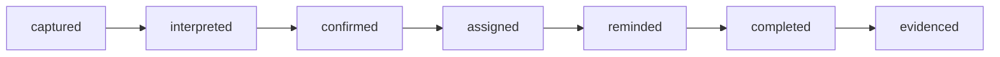

# App plan — the Life Admin platform, first app: **ShiftLife** (working title)

> **Status:** `plan` — awaiting owner go/no-go (see [Decisions](#12-owner-decisions--one-letter-answerable) below; queued as `OQ-APP-PLAN-GO`).
>
> Drafted 2026-07-24 from the owner's pasted market research (ChatGPT deep-research
> summary, provided in the hub chat 2026-07-24) plus this seat's own assessment.
> Competitor prices quoted below come from that research and are as-of its research
> date — re-verify before we publish any comparison publicly.

## 1. TL;DR

**Build one reusable "Personal Operations Core", and ship ShiftLife first: the
schedule app for shift-working households.** Not "when am I working?" — every shift
app answers that — but **"when are we both free, who can take the kids Thursday, and
did my roster just change?"**

- **Free forever, for everyone:** the full calendar — rotation patterns, unlimited
  shifts, partner/family sharing, overlap finder, reminders, calendar export. No ads,
  no data selling, no feature that stops working after a trial.
- **Paid (one-time purchase, default €14.99):** the power extras — AI roster import
  from a screenshot/PDF, earnings estimation with visible math, roster-change
  detection, deep statistics.
- **The wedge:** start with the community the owner knows personally — Dutch inland
  shipping (binnenvaart) rotations — then nursing, police, factory and transport
  shift patterns. Vertical trust first, mass market second.
- **The platform play:** the intake → confirm → remind → evidence pipeline built for
  rosters is the same machinery the research's other winners need (Home Passport,
  Care Circle, Claims Assistant). We build it once, narrowly, inside ShiftLife — and
  only extract it into a shared core when app #2 starts.

The rest of this doc is the pre-chewed version: what exactly v1 contains, what is
free vs paid (with a charter so the line never creeps), the architecture, a phased
roadmap with honest exit criteria, go-to-market, costs, risks, and the short list of
decisions only the owner can take.

## 2. Which app, and why this one

The research scored eight ideas; the two 9/10s were **Life Admin Inbox** and
**ShiftLife**. We agree with the research's final recommendation — ShiftLife first —
and add one argument the research undersold, which happens to be decisive given the
owner's "core must be free forever" requirement:

**ShiftLife's core is deterministic, so a free user costs us almost nothing.**
Rotation math, calendar views, household sharing and reminders are pure logic — they
run on the phone. A Life-Admin-Inbox free user, by contrast, consumes paid AI
processing on every document they forward. With "never impair the free core" as a
hard rule, ShiftLife's economics work at any scale; an inbox product's free tier
would either bleed money or quietly get crippled — exactly what we promised not to do.

The other reasons, in order of weight:

1. **Daily-open app with built-in word of mouth.** A shift calendar is opened every
   day and shown to colleagues in the crew room / break room ("what app is that?").
   A life-admin inbox is a background utility you check when a letter arrives.
2. **Sharp, reachable audience.** Roughly one in five European employees works
   shifts. They cluster in communities we can actually reach (nursing, police,
   maritime, factory forums/subreddits — the research quotes them asking for exactly
   this product).
3. **Validated willingness to pay, with a resented pricing model.** MyShiftPlanner
   and Supershift sell premium tiers (Supershift €9.99/yr or €39.99 lifetime per the
   research); users in the research complain about subscriptions. A genuinely free
   core plus a fair one-time purchase is a positioning attack, not just a feature list.
4. **Owner's unfair advantage.** Irregular rotations (binnenvaart 14/14 and similar)
   are lived experience here, plus direct access to that community for the beta. No
   competitor treats inland shipping as a first-class template.
5. **Low trust barrier.** v1 needs no email access, no bank link, no health data.
   The AI intake (roster screenshots) arrives only in phase 2, scoped to one
   document type, with a human-confirm step — the gentlest possible way to earn the
   trust the bigger life-admin vision will need later.

### Why not the others first

- **Life Admin Inbox** — still the long-term prize; it becomes the *platform story*
  (§5) rather than app #1. Cold-starting an unknown brand on "forward us your email"
  is the hardest possible opening move, and free-tier AI costs fight the charter.
- **Home Passport** — strong candidate for **app #2**; reuses the same intake and
  asset/document objects. Purchase frequency and daily engagement are too low for a
  first app.
- **Care Circle** — real and moving, but an unknown brand asking families for
  care data before we've proven ourselves is premature; revisit at app #2/#3.
- **Claims Assistant** — good future module on the same evidence timeline; too
  country-specific to be first.
- **Local Circles / One Thing Now / Hold Guardian** — per the research: network
  effects, saturated category and telecom infrastructure respectively. Not now.

### What we will not build (standing list)

No generic AI family calendar, no plain to-do list, no habit tracker, no swiping
social app, no "AI life assistant" without a deterministic workflow underneath.
And three product vows regardless of app: **no ads, ever; no selling or brokering
user data, ever; no dark-pattern paywalls** (no trial that expires the core, no
"your data is hostage" export fees).

## 3. The product

### Who it's for (personas we design against)

1. **The rotation worker** — deckhand/skipper on 14/14, nurse on irregular rosters,
   police officer on a 5-shift pattern. Question: *"When do I work, and what does my
   month look like?"*
2. **The partner at home** — plans childcare, appointments, family visits around a
   rotation they don't control. Question: *"When is my partner actually here — and
   free?"*
3. **The two-roster household** — both work shifts (the research's r/policeuk quote:
   two patterns, one shared view for family/childcare). Question: *"Which evenings
   and weekends overlap?"*
4. **The grandparent / babysitter** — needs read-only sight of the rota, zero setup.

### v1 — the free core (everything below is free, forever)

1. **Pattern builder + template library.** Rotating patterns of any cycle length;
   shipped presets for common systems (4-on-4-off, Continental, DuPont, 2-2-3, and
   binnenvaart presets: 14/14, 21/21, 1-op-1-af, 3/3) plus fully custom cycles,
   exceptions and swaps (trade a shift, mark sick/leave/course days).
2. **Shift types** with times, colors and icons (Early/Late/Night/Off/Standby/custom).
3. **Calendar** — month + agenda views, fast entry, works fully offline.
4. **Household** — invite partner and kids' schedules by link; overlaid calendars;
   an **overlap finder** ("show me evenings/weekends we're both off" — the headline
   feature, on the home screen, not buried).
5. **Read-only sharing** — a link (web view + calendar subscription) for the
   grandparents; no account or app install required on their side.
6. **Reminders** — shift start, "night shift tomorrow" prep nudge, pattern anomalies
   ("your Friday changed").
7. **Calendar export** — ICS subscribe URLs and one-tap export to Google/Apple
   calendar. **Data is never locked in**: full export (JSON/CSV/ICS) sits in
   settings, free.
8. **Privacy by default** — local-first storage; an account exists only to enable
   sharing; no location tracking; delete-account really deletes.

### Pro — the one-time purchase (default €14.99, household-wide)

1. **AI roster import.** Photograph/screenshot/PDF/spreadsheet in → proposed shifts
   out → **user confirms before anything lands in the calendar** (the confirm step is
   a product feature *and* our accuracy safety net). Fair-use unlimited for Pro; every
   free user gets a small monthly taste (default: 2 imports/month) so the magic is
   discoverable — a bonus above the free core, not a gate on it.
2. **Earnings estimation with visible math.** Hourly rate + night/weekend/overtime
   premiums and allowances → month forecast, every step shown ("show your work" is
   the differentiator — the research says workers distrust black-box pay apps).
   Country/sector rule packs come later as data modules (CAO Binnenvaart first).
3. **Roster-change detection.** Import a revised roster → side-by-side diff of what
   changed, with alerts ("your 14th became a night shift").
4. **Deep statistics.** Nights/weekends/holidays worked, fairness overview, leave
   what-ifs ("if I take the 3rd–10th off, which overlap weekends survive?").
5. **Cosmetics + niceties.** Themes, app icons, widgets beyond the basic one.

One purchase covers the whole household (family-shared via the store's family
sharing where possible, otherwise via our household object). Rationale for one-time
over subscription: it matches the community's loud subscription fatigue (the
research's "€12.99 a month? get f\*cked" quote), it's a launch-marketing weapon, and
our marginal costs are near zero *because* the core is deterministic. The one real
recurring cost — AI import — is bounded by fair-use and is pennies per import (§9).
**Fallback lever** (only if real usage proves costlier): keep Pro one-time but sell
AI import top-up packs beyond fair use; never move core features behind anything.

### Non-goals for v1

No employer/enterprise rostering (we serve the worker, not the scheduler — a future
B2B lane at most), no shift-swap marketplace, no chat (families have WhatsApp), no
web app for the worker (read-only share pages only), no Android/iOS feature skew.

## 4. The free-forever charter

The line between free and paid will be tested every month of this product's life, so
we fix it now with a written rule, in priority order:

1. **The core question test.** If removing a feature would stop a free user from
   answering *"when am I working, and when are we both free?"* — it can never be
   paid. This covers patterns, calendar, household overlay, overlap finder, sharing,
   reminders, export.
2. **The marginal-cost test.** Features that cost us real money per use (AI
   processing) may be paid, with a free taste.
3. **The convenience test.** Paid features save time or add insight (import, pay
   math, diffs, stats) — they never add back basic capability.
4. **No regression rule.** A feature once shipped free never moves behind the
   paywall. New paid features must be new value.
5. **No count-based crippling.** Free is never limited by number of shifts, people
   in the household, or devices.

Any future feature PR that touches monetization must state which test it passes.

## 5. The platform underneath (why this isn't "just another shift app")

The research's sharpest insight is the obligation lifecycle:

ShiftLife phase 2 implements exactly this, on one narrow document type:

- **captured** — roster screenshot/PDF lands in the intake
- **interpreted** — AI extracts shifts (dates, types, times) with confidence scores
- **confirmed** — user reviews a proposed-changes screen; nothing silent
- **assigned** — shifts belong to a person in a household with roles
- **reminded** — the rules/notification engine
- **completed** — the shift happened; history accumulates
- **evidenced** — worked-hours record + pay math = "prove what I worked/earned"

Household, Person, Event/Shift, Document, and the intake-confirm-remind-evidence
machinery are precisely the shared objects the research lists for the Personal
Operations Core. **We deliberately do NOT build the core as a separate framework
now** — that's how platform projects die. We build ShiftLife cleanly (domain
package separated from UI), and when app #2 (likely Home Passport) starts, we
extract the proven parts. The platform is a refactor we earn, not a bet we prefund.

## 6. Architecture & stack (fleet-buildable, boring on purpose)

- **App:** Expo / React Native, TypeScript — one codebase for iOS + Android, strong
  agent ergonomics, over-the-air updates for fast beta iteration.
- **Local-first:** SQLite on device is the source of truth; the app is fully useful
  offline (ships, hospitals and factories are exactly where connectivity dies).
  Sync is a thin layer on top, only needed once a household has 2+ members.
- **Backend:** small TypeScript API (Hono or Fastify) + Postgres, deployed on
  **Railway** (already a verified fleet capability with API access) — handles auth,
  household sync, share pages, ICS feeds, push scheduling.
- **AI intake service:** one server endpoint wrapping the Claude API (cheap model
  tier for extraction — roster images are a constrained, schema-driven task) →
  structured shift JSON + confidence → client confirm screen. Every import runs
  against an **eval set of real anonymized rosters** in CI so accuracy is measured,
  not vibed.
- **Pure domain package:** the pattern/rotation engine and pay calculator are pure
  TypeScript functions with exhaustive tests — date math across midnight, DST and
  month boundaries is where shift apps rot, so this package is the quality moat.
- **Repo:** one new monorepo (proposed name `shiftlife`, rename with the product):
  `apps/mobile` · `apps/api` · `packages/domain` · `packages/eval`. CI: typecheck,
  tests (domain package at ~100% coverage), eval-set accuracy report, EAS build.

## 7. Roadmap — phases with exit criteria (no calendar promises)

**Phase 0 — Decide & scaffold.** Owner go/no-go + name direction; repo scaffold,
domain package with pattern engine + tests; 3 clickable design directions to pick
from; owner recruits 5–10 beta households (binnenvaart network first).
*Exit:* owner has picked name + design; repo CI green; beta list exists.

**Phase 1 — MVP, free core only.** Features §3 v1 items 1–8, TestFlight/Play
internal track. *Exit:* owner's own household plus ≥5 beta households on it for
2 weeks; ≥60% of beta households used the overlap finder; crash-free ≥99.5%.

**Phase 2 — AI roster import + hardening.** Intake→confirm pipeline behind a beta
flag; eval set ≥30 real rosters, ≥95% field accuracy *after* the confirm screen;
polish from beta feedback. *Exit:* beta users successfully import their real roster
unaided; accuracy bar met on the eval set.

**Phase 3 — Public launch.** Store listings NL + EN, Pro purchase live, share
pages public, community launch posts (binnenvaart groups, then r/nursing, r/policeuk
etc. — genuine "we built this for us" posts, not ads). *Exit:* live in both stores;
first organic (non-beta) Pro purchases; support load sustainable.

**Phase 4 — Earnings engine + roster diff.** Transparent pay math with CAO
Binnenvaart as the first rule pack; revised-roster comparison. *Exit:* a real
binnenvaart payslip month matches our estimate within agreed tolerance; diff alerts
validated by beta users.

**Phase 5 — Platform extraction + app #2 decision.** Extract the proven
intake/household/rules machinery into shared packages; owner picks app #2 (default
recommendation: Home Passport) with a plan doc like this one.

## 8. Go-to-market

1. **Niche beachhead:** binnenvaart. NL + EN localized from day 1 (the app is
   Dutch-born — wear it proudly in the story). A rotation template that greets a
   deckhand with "14/14 — kies je wisseldag" wins that community instantly.
2. **Community-led, founder-fronted:** the owner's genuine story ("built this for
   our own rotation") in the communities the research quotes. Agents draft, owner
   posts — astroturfing would burn the one asset we have.
3. **Built-in growth loops:** every read-only share page and every exported ICS feed
   is a branded touchpoint reaching exactly the right next user (another shift
   family). The overlap finder screenshot is the shareable artifact.
4. **Expansion order:** binnenvaart → nursing → police/emergency → factory/logistics.
   Each vertical = a template pack + a community post + (later) a pay rule pack,
   not a new app.
5. **Positioning line:** *"The shift calendar for your whole household. Free. No
   ads. No subscription."*

## 9. Numbers (rough, honest)

**Costs.** Railway (API + Postgres + share pages): ~€5–20/mo at beta scale, grows
slowly because sync is thin. AI import: a roster image on a cheap Claude tier is
roughly €0.001–0.01; at fair-use Pro volumes that's cents per Pro user per month,
covered many times over by €14.99 one-time. Fixed: Apple dev account $99/yr, Google
Play $25 once. Store cut: 15% (small-business tiers). Total burn before launch:
essentially hosting + store accounts — this plan risks time, not money.

**Targets to take seriously (not vanity):** % of installs that create/join a
household with 2+ people (the product thesis in one number — target ≥35% by phase 3);
week-4 retention of household users (target ≥40%); free→Pro conversion (healthy
range 2–5%); AI import confirm-without-edit rate (target ≥80% by phase 4).

**Honest kill/pivot criteria.** If after ~8 weeks of public phase 3 the household
number stays under ~15% and week-4 retention under ~20% despite iteration, the
"household OS" thesis is wrong — we stop, write the retro, and take the domain
package + intake pipeline into the next vertical rather than sunk-costing.

## 10. Risks & mitigations

| Risk | Mitigation |
|---|---|
| AI extraction errors erode trust (a wrong night shift is a hard failure) | Confirm-before-commit always; confidence highlighting; eval set in CI; import is additive convenience, never silent |
| An incumbent (MyShiftPlanner etc.) copies the household angle | Our moat is positioning (free core + one-time price they can't match without gutting subscription revenue), vertical templates, and community trust — move fast in the niche |
| Lifetime pricing vs long-term server costs | Local-first keeps per-user cost near zero; fallback lever in §3 pre-agreed (top-up packs, never core gating) |
| Date/DST/timezone bugs (the classic shift-app killer) | Pure domain package, property-based tests, DST/midnight/month-boundary cases explicit in CI |
| Scope creep toward "everything app" | §3 non-goals + §4 charter are standing review criteria on every feature PR |
| Owner bandwidth (non-coder, one person) | Fleet builds/tests/ships; owner's lane is taste, community and decisions — pre-chewed, one-letter answerable, as with this doc |
| Store review friction (first-time publisher) | Agent-prepared EAS builds + step-by-step store checklists; minimal permissions requested (no location, no contacts) |

## 11. How we build it together

**Fleet side (agents):** scaffold repo + CI; build domain package test-first; build
app + API; prepare EAS builds and store metadata; draft community posts and
localization; run the eval set; maintain the plan's charter in review.

**Owner side (the human lane):** the §12 decisions; Apple/Google developer accounts
(identity + payment — genuinely owner-only); picking the design direction; being
beta household #1 on a real rotation; recruiting the binnenvaart beta circle;
fronting the community posts; final say on name and price.

**Fleet mechanics:** on GO, create repo `shiftlife` (private until launch), seed
with the §6 scaffold, and open the first issue set: (1) domain pattern engine +
tests, (2) calendar UI shell, (3) household invite flow, (4) share page + ICS feed,
(5) reminder engine, (6) design directions A/B/C. Track cross-repo status from the
hub roster like every other fleet repo.

## 12. Owner decisions — one-letter answerable

| # | Decision | Default (reply "go, defaults" to take all) |
|---|---|---|
| D1 | Go/no-go on ShiftLife-first (vs Life-Admin-Inbox-first) | **GO — ShiftLife first** |
| D2 | Working name | Keep **ShiftLife** as working title; final name + trademark check before phase 3 store listing (agents will shortlist; owner picks) |
| D3 | Pricing | **Free core forever + one-time Pro €14.99** (intro €9.99 at launch), household-wide; free taste of AI import (2/month) |
| D4 | Beta circle | Owner recruits **5–10 binnenvaart households** during phase 0–1 |
| D5 | Store accounts | Owner creates Apple Developer ($99/yr) + Google Play ($25) when phase 2 nears — click-level checklist will be prepared |

A single "go, defaults" starts phase 0. Any D can be overridden individually.

## 13. Provenance

- Input: owner-pasted ChatGPT deep-research summary (hub chat, 2026-07-24) — eight
  scored ideas, community quotes (r/CaregiverSupport, r/policeuk, r/ireland),
  competitor pricing (MyShiftPlanner, Supershift, Cozi, HomeZada, Caring Village,
  Meetup), and the Personal Operations Core architecture sketch. Quoted figures are
  that research's, as of its date; re-verify before public use.
- This doc: fleet-manager hub seat, 2026-07-24, on owner-live instruction ("come up
  with a solid plan for an app we can create together; most of it completely free;
  core functionality never impaired for free users"). The free-forever charter (§4)
  encodes that instruction as standing product law.
